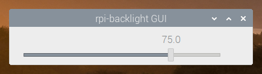
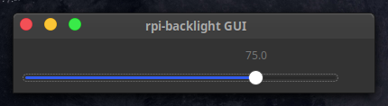
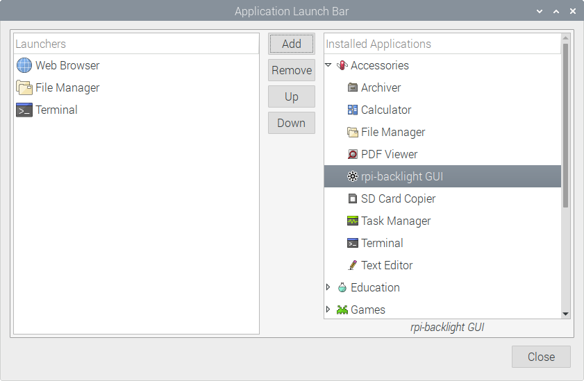

.. _usage:

Usage
=====

Python API
----------

Make sure you've :ref:`installed <installation>` the library correctly.

Open a Python shell and import the :class:`~rpi_backlight.Backlight` class:

.. code-block:: python

    >>> from rpi_backlight import Backlight

Create an instance:

.. code-block:: python

    >>> backlight = Backlight()

Now you can get and set the display power and brightness:

.. code-block:: python

    >>> backlight.brightness
    100
    >>> backlight.brightness = 50
    >>> backlight.brightness
    50
    >>>
    >>> with backlight.fade(duration=1):
    ...     backlight.brightness = 0
    ...
    >>> backlight.fade_duration = 0.5
    >>> # subsequent `backlight.brightness = x` will fade 500ms
    >>>
    >>> backlight.power
    True
    >>> backlight.power = False
    >>> backlight.power
    False
    >>>

See the :ref:`API reference <api>` for more details.

Command line interface
----------------------

Open a terminal and run ``rpi-backlight``.

.. code-block:: console

    $ rpi-backlight -b 100
    $ rpi-backlight --set-brightness 20 --duration 1.5
    $ rpi-backlight --get-brightness
    20
    $ rpi-backlight --get-power
    on
    $ rpi-backlight --p off
    $ rpi-backlight --get-power
    off
    $ rpi-backlight --set-power off :emulator:
    $

You can set the backlight sysfs path using a positional argument, set it to `:emulator:`
to use with `rpi-backlight-emulator`.

Available options:

.. code-block:: none

    usage: rpi-backlight [-h] [--get-brightness] [-b VALUE] [--get-power]
                        [-p VALUE] [-d DURATION] [-V]
                        [SYSFS_PATH]

    Get/set power and brightness of the official Raspberry Pi 7" touch display.

    positional arguments:
    SYSFS_PATH            Optional path to the backlight sysfs, set to
                            :emulator: to use with rpi-backlight-emulator

    optional arguments:
    -h, --help            show this help message and exit
    --get-brightness      get the display brightness (0-100)
    -b VALUE, --set-brightness VALUE
                            set the display brightness (0-100)
    --get-power           get the display power (on/off)
    -p VALUE, --set-power VALUE
                            set the display power (on/off)
    -d DURATION, --duration DURATION
                            fading duration in seconds
    -V, --version         show program's version number and exit

Graphical user interface
------------------------

Open a terminal and run ``rpi-backlight-gui``.

Adding a shortcut to the LXDE panel
~~~~~~~~~~~~~~~~~~~~~~~~~~~~~~~~~~~

.. image:: _static/panel_result.png
   :alt: Panel Result

First, create a ``.desktop`` file for rpi-backlight (e.g.
``/home/pi/.local/share/applications/rpi-backlight.desktop``) with the following content:

.. code-block:: none

    [Desktop Entry]
    Version=1.0
    Type=Application
    Terminal=false
    Name=rpi-backlight GUI
    Exec=/home/pi/.local/bin/rpi-backlight-gui
    Icon=/usr/share/icons/HighContrast/256x256/status/display-brightness.png
    Categories=Utility;

*The absolute path to* ``rpi-backlight-gui`` *might differ if you did not follow the
installation instructions exactly, e.g. installed as root.*

Make it executable:

.. code-block:: console

    $ chmod +x /home/pi/.local/share/applications/rpi-backlight.desktop

You should now be able to start the rpi-backlight GUI from the menu:
``(Raspberry Pi Logo) → Accessoires → rpi-backlight GUI``.

Next, right-click on the panel and choose ``Add / Remove panel items``. Select
``Application Launch Bar`` and click ``Preferences``:

.. image:: _static/panel_preferences.png
   :alt: Panel Preferences

Select ``rpi-backlight GUI`` on the right and click ``Add``:

You're done!

.. include:: global.rst
